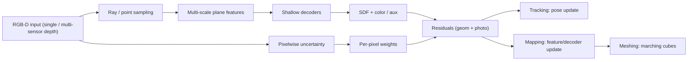

<div align="center">

# WIMSO-SLAM

**WIMSO-SLAM** = **W**eighted **I**mplicit **M**ulti-Scale **S**DF SLAM with **O**nline Pixelwise Uncertainty Reweighting

**EN:** Dense RGB-D neural SLAM for robust tracking & mapping under **noisy / missing / multi-sensor depth**.  
**JP:** ノイズ・欠損・マルチセンサ深度に対して頑健な **Dense RGB-D Neural SLAM** 実装。

<!-- Badges (replace <USER>/<REPO> after publishing) -->
<p>

  </a>
  
  
</p>

</div>

---

## ✨ What this repo provides / このリポジトリでできること

| EN | JP |
|---|---|
| Online dense mapping with a **hybrid implicit SDF** map (multi-scale plane features + lightweight decoders) | **多尺度 Feature Plane + 軽量 Decoder** によるハイブリッド暗黙 SDF をオンライン最適化 |
| **Online pixelwise uncertainty** to reweight tracking/mapping losses (optionally per-sensor) | **画素単位の不確実性** に基づく損失の重み付け（センサ別も可） |
| Mesh extraction (marching cubes), trajectory export, lightweight evaluation utilities | メッシュ生成（Marching Cubes）、軌跡出力、簡易評価ツール |


> **Personal learning project / 個人学習プロジェクト**  
> EN: This repository is a personal SLAM development exercise for learning and experimentation (personal use).  
> JP: 本リポジトリは個人の学習・実験目的の SLAM 開発練習です（個人利用）。

---

## Table of Contents / 目次

- [Motivation](#motivation--背景)
- [Method at a Glance](#method-at-a-glance--手法概要)
- [Inputs & Outputs](#inputs--outputs--入出力)
- [Installation](#installation--インストール)
- [Datasets](#datasets--データセット)
- [Quickstart](#quickstart--最短実行)
- [Configuration](#configuration--設定yaml)
- [Evaluation](#evaluation--評価)
- [Visualization](#visualization--可視化)
- [Project Structure](#project-structure--構成)
- [Troubleshooting](#troubleshooting--よくある問題)
- [References](#references--参考文献)
- [License & Third-Party Notes](#license--third-party-notes--ライセンス)

---

## Motivation / 背景

**EN:**  
Dense RGB-D SLAM becomes fragile when depth contains **noise**, **holes**, **mixed sensors**, or **domain shifts**.
A small number of unreliable pixels can dominate optimization and destabilize pose tracking and mapping.

**JP:**  
密 SLAM は深度の **ノイズ**・**欠損**・**マルチセンサ混在**・**ドメインシフト** の影響を受けやすく、
少数の外れ値ピクセルが最適化を支配して Tracking / Mapping が不安定になりがちです。

**WIMSO-SLAM** addresses this with:
1) a lightweight, online-optimizable **implicit SDF** representation, and  
2) **online uncertainty-guided reweighting** that downweights unreliable pixels.

---

## Method at a Glance / 手法概要

### Pipeline / パイプライン



### Key ideas / コアアイデア

**1) Hybrid implicit SDF map / ハイブリッド暗黙 SDF**  
- **EN:** Multi-scale **feature planes** queried at 3D locations + shallow decoders → SDF (and optional color/aux).  
- **JP:** 3D 位置で **多尺度 Feature Plane** をサンプリングし、浅い Decoder で SDF（+色等）を推定。

**2) Online pixelwise uncertainty / オンライン画素単位不確実性**  
- **EN:** Predict per-pixel uncertainty (optionally per-sensor). Convert to weights for robust losses.  
- **JP:** 画素単位の不確実性（必要ならセンサ別）を推定し、損失の重みに変換して外れ値影響を抑制。

**3) Tracking & mapping / Tracking と Mapping**  
- **EN:** Both pose optimization and map optimization use the same uncertainty-aware weighting.  
- **JP:** 姿勢推定とマップ更新の両方で同じ不確実性重みを適用。

> Implementation pointers / 実装の参照先: `wimsoslam/Tracker.py`, `wimsoslam/Mapper.py`, `wimsoslam/utils/Renderer.py`, `wimsoslam/networks/*`

---

## Inputs & Outputs / 入出力

### Inputs / 入力

**Primary input:** RGB-D sequence (single-sensor or multi-sensor depth).  
**JP:** RGB-D 連番（単一深度 or 複数深度センサ）を想定。

Configure dataset root via YAML `data.input_folder` or CLI `--input_folder`.

### Outputs / 出力

**Default output directory:** `data.output` (or CLI `--output`)  
Typical structure:

```
<OUTPUT>/
  ckpts/          # checkpoints / チェックポイント
  mesh/           # meshes (*.ply) / メッシュ
  traj/           # trajectory / 軌跡
  logs/           # metrics & timing / ログ
  tracking_vis/   # (optional) tracking debug / 可視化
  mapping_vis/    # (optional) mapping debug / 可視化
```

### CLI contract / CLI の仕様

```bash
python run.py <CONFIG_YAML> [--input_folder DATA_ROOT] [--output OUTPUT_DIR]
```

---

## Installation / インストール

### Prerequisites / 前提

- Python **3.8+**
- CUDA GPU recommended (for practical speed) / CUDA GPU 推奨

### Option A: Conda (recommended) / Conda（推奨）

```bash
conda env create -f environment.yaml
conda activate wimsoslam
pip install -e .
```

### Option B: pip / pip

```bash
python -m venv .venv
source .venv/bin/activate
pip install -r requirements.txt
pip install -e .
```

Run a quick import test:

```bash
pytest -q
```

---

## Datasets / データセット

Supported loaders / 対応ローダ:
- Replica
- ScanNet
- TUM RGB-D

Dataset scripts / ダウンロード補助:
```bash
bash scripts/download_replica.sh
bash scripts/download_tum.sh
```

Loader implementations / 実装: `wimsoslam/utils/datasets.py`

> EN: If your folder layout differs, add a loader and keep the rest of the pipeline unchanged.  
> JP: データ形式が異なる場合は loader を追加すれば、残りはほぼそのまま使えます。

---

## Quickstart / 最短実行

### 1) Run SLAM / 実行

```bash
python run.py configs/wimso_default.yaml
```

Override paths / パス上書き:

```bash
python run.py configs/wimso_default.yaml \
  --input_folder /path/to/dataset_root \
  --output /path/to/output_dir
```

### 2) Visualize / 可視化

```bash
python visualizer.py configs/wimso_default.yaml --output /path/to/output_dir
```

---

## Configuration / 設定（YAML）

Main config / メイン設定: `configs/wimso_default.yaml`

### Common knobs / よく使う項目

| Key | EN | JP |
|---|---|---|
| `data.dataset` | dataset type (`replica` / `scannet` / `tum`) | データセット種別 |
| `data.input_folder` | dataset root | データルート |
| `data.output` | output directory | 出力先 |
| `tracking.*` | tracking iterations & losses | Tracking の反復・損失 |
| `mapping.*` | mapping iterations & losses | Mapping の反復・損失 |
| `uncertainty.*` | uncertainty model & weighting | 不確実性モデルと重み付け |
| `meshing.*` | marching cubes settings | メッシュ生成設定 |

Tip / ヒント:
- EN: start with fewer mapping iterations to avoid OOM, then scale up.  
- JP: 最初は mapping 反復を少なめにして OOM を避け、徐々に増やすのがおすすめ。

---

## Evaluation / 評価

### ATE (trajectory) / 軌跡 ATE

```bash
python -m wimsoslam.tools.eval_ate --output /path/to/output_dir
```

### Mesh post-processing (optional) / メッシュ後処理（任意）

```bash
python -m wimsoslam.tools.cull_mesh --output /path/to/output_dir
```

---

## Visualization / 可視化

- `visualizer.py` replays the trajectory and can optionally save videos.  
- `wimsoslam/tools/visualizer_util.py` contains helper functions.

```bash
python visualizer.py -h
```

---

## Project Structure / 構成

```
.
├─ configs/                 # YAML configs / 設定
├─ scripts/                 # dataset helper scripts / 補助
├─ wimsoslam/
│  ├─ system.py             # system orchestration / 全体制御
│  ├─ Tracker.py            # pose tracking / Tracking
│  ├─ Mapper.py             # mapping & optimization / Mapping
│  ├─ networks/             # decoders + uncertainty modules
│  ├─ utils/                # datasets, rendering, meshing, logging
│  └─ tools/                # evaluation & visualization tools
├─ run.py                   # entry point / 実行
└─ visualizer.py            # visualization / 可視化
```

---

## Troubleshooting / よくある問題

### CUDA out of memory (OOM)
- **EN:** reduce mapping iterations, hidden dims, or input resolution.  
- **JP:** mapping 反復数・hidden dim・解像度を下げてください。

### Dataset not loading
- **EN:** confirm folder layout matches the selected loader.  
- **JP:** loader の想定するフォルダ構成を確認してください。

### Slow first run
- **EN:** first-time cache/JIT can be slower.  
- **JP:** 初回はキャッシュ作成で遅くなる場合があります。

---

## References / 参考文献

**EN:** Selected references on dense RGB-D SLAM, neural implicit (SDF/TSDF) mapping, and uncertainty-aware optimization.  
**JP:** Dense RGB-D SLAM、暗黙表現（SDF/TSDF）によるマッピング、および不確実性を考慮した最適化に関する参考文献。

- M. M. Johari, C. Carta, F. Fleuret, **“ESLAM: Efficient Dense SLAM System Based on Hybrid Representation of Signed Distance Fields”**, *CVPR 2023*.  
  PDF: https://openaccess.thecvf.com/content/CVPR2023/papers/Johari_ESLAM_Efficient_Dense_SLAM_System_Based_on_Hybrid_Representation_of_CVPR_2023_paper.pdf  
  arXiv: https://arxiv.org/abs/2211.11704

- E. Sandström, M. Oswald, E. Brachmann, **“UncLe-SLAM: Uncertainty Learning for Dense Neural SLAM”**, *ICCV Workshops 2023*.  
  PDF: https://openaccess.thecvf.com/content/ICCV2023W/UnCV/papers/Sandstrom_UncLe-SLAM_Uncertainty_Learning_for_Dense_Neural_SLAM_ICCVW_2023_paper.pdf  
  arXiv: https://arxiv.org/abs/2306.11048

- Z. Zhu, S. Peng, V. Larsson, W. Xu, H. Bao, Z. Cui, M. R. Oswald, M. Pollefeys, **“NICE-SLAM: Neural Implicit Scalable Encoding for SLAM”**, *CVPR 2022*.  
  PDF: https://openaccess.thecvf.com/content/CVPR2022/papers/Zhu_NICE-SLAM_Neural_Implicit_Scalable_Encoding_for_SLAM_CVPR_2022_paper.pdf  
  arXiv: https://arxiv.org/abs/2112.12130

- J. Ortiz, A. Clegg, J. Dong, E. Sucar, D. Novotny, M. Zollhöfer, M. Mukadam, **“iSDF: Real-Time Neural Signed Distance Fields for Robot Perception”**, *RSS 2022* (arXiv).  
  arXiv: https://arxiv.org/abs/2204.02296

- E. Sucar, S. Liu, J. Ortiz, A. J. Davison, **“iMAP: Implicit Mapping and Positioning in Real-Time”**, *ICCV 2021*.  
  PDF: https://openaccess.thecvf.com/content/ICCV2021/papers/Sucar_iMAP_Implicit_Mapping_and_Positioning_in_Real-Time_ICCV_2021_paper.pdf  
  arXiv: https://arxiv.org/abs/2103.12352

- A. Dai, M. Nießner, M. Zollhöfer, S. Izadi, C. Theobalt, **“BundleFusion: Real-time Globally Consistent 3D Reconstruction using On-the-fly Surface Re-integration”**, *SIGGRAPH 2017* (arXiv).  
  arXiv: https://arxiv.org/abs/1604.01093

- R. A. Newcombe, S. Izadi, O. Hilliges, D. Molyneaux, D. Kim, A. J. Davison, P. Kohli, J. Shotton, S. Hodges, A. Fitzgibbon, **“KinectFusion: Real-time Dense Surface Mapping and Tracking”**, *ISMAR 2011*.  
  PDF: https://www.microsoft.com/en-us/research/wp-content/uploads/2016/02/ismar2011.pdf

- Z. Zhu, S. Peng, V. Larsson, Z. Cui, M. R. Oswald, A. Geiger, M. Pollefeys, **“NICER-SLAM: Neural Implicit Scene Encoding for RGB SLAM”** (arXiv).  
  arXiv: https://arxiv.org/abs/2302.03594

## License & Third-Party Notes / ライセンス

- **License:** Apache-2.0 (see `LICENSE`)
- **Third-party notices:** if you redistribute modified components, keep the notice text in `NOTICE`.  
- **Credits:** `ACKNOWLEDGEMENTS.md` lists external inspirations and components.

> EN: Provided **as is** for personal research/learning and experimentation. Not intended for safety-critical use.  
> JP: 個人の研究・学習・実験目的で **現状のまま** 提供します。安全重要用途での利用は想定していません。

> EN: Keeping notices/credits is recommended for open-source compliance and good engineering practice.  
> JP: OSS 準拠・エンジニアリングの礼儀として、notice/credit の保持を推奨します.
